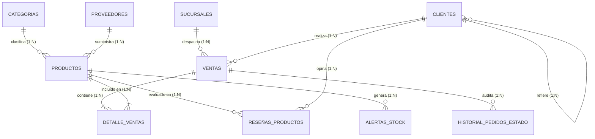

# Proyecto de Base de Datos para un E-commerce

## 1. Descripción Breve
Este proyecto implementa el núcleo robusto, seguro y escalable de una base de datos relacional para una plataforma de **E-commerce** en **MySQL 8.0.19 o superior**. Contempla el ciclo completo de diseño y optimización: normalización relacional, integridad referencial con claves foráneas y restricciones `CHECK`, reportería analítica avanzada (20 consultas de negocio), encapsulación de lógica mediante funciones definidas por el usuario (20 UDFs), políticas granulares de seguridad basadas en roles y vistas (20 requisitos), disparadores de automatización y auditoría (20 triggers), tareas programadas en segundo plano (20 eventos) y procedimientos almacenados transaccionales (20 SPs con soporte `START TRANSACTION`, `COMMIT` y `ROLLBACK`).

---

## 2. Integrantes del Equipo
- **Deyvid Godoy** (*Estudiante / Desarrollador Principal*)
- *(Espacio para integrantes adicionales del equipo de trabajo)*

---

## 3. Arquitectura y Modelo de Datos



---

## 3.1 Requisitos del Servidor

| Requisito | Motivo |
|---|---|
| **MySQL 8.0.19+** | Roles (`CREATE ROLE`), CTEs (`WITH`), funciones de ventana (`NTILE`, `ROW_NUMBER`, `LAG`), restricciones `CHECK` aplicadas (8.0.16+), `REVOKE IF EXISTS` (8.0.16+) y `FAILED_LOGIN_ATTEMPTS` (8.0.19+) |
| **Motor InnoDB** | Claves foráneas y transacciones ACID en los procedimientos |
| **Charset `utf8mb4`** | Identificadores y datos con `ñ` y tildes |
| **Privilegios `SUPER` / `SYSTEM_VARIABLES_ADMIN`** | `SET GLOBAL event_scheduler`, `log_error_verbosity` y `validate_password.*` en `04` y `06` |

> El proyecto **no** es compatible con MariaDB sin modificaciones: `log_error_verbosity`, el componente `validate_password` y la sintaxis `SET DEFAULT ROLE ... TO` (MariaDB usa `FOR`) difieren.

> **Verificado:** los 7 scripts se ejecutaron de principio a fin, en orden y sobre una base limpia, en **MySQL Community Server 26.7.0**, sin errores. Objetos creados: 32 tablas, 2 vistas, 20 funciones, 20 procedimientos, 30 triggers, 20 eventos, 7 roles y 5 usuarios.

---

## 4. Instrucciones de Ejecución

Para garantizar la integridad referencial y la correcta instanciación de todos los objetos, los scripts SQL deben ejecutarse de manera secuencial estricta desde la raíz del proyecto:

| Orden | Archivo SQL | Descripción del Script | Evidencia |
|:---:|---|---|:---:|
| **1°** | [`01_Esquema_y_Datos.sql`](01_Esquema_y_Datos.sql) | Crea la base de datos `ecommerce_db`, las tablas principales y de soporte, y carga los datos de prueba estandarizados. | [Ver Evidencia](evidencias/01_tablas_y_datos.md) |
| **2°** | [`02_Consultas_Avanzadas.sql`](02_Consultas_Avanzadas.sql) | Ejecuta las 20 consultas de análisis de negocio (Top 10, LTV, RFM, Cohortes, Rotación, etc.). | [Ver Evidencia](evidencias/02_consultas_avanzadas.md) |
| **3°** | [`03_Funciones.sql`](03_Funciones.sql) | Registra las 20 funciones de usuario (UDF) para cálculos de IVA, edad, stock, formatos y validaciones. | [Ver Evidencia](evidencias/03_funciones.md) |
| **4°** | [`04_Seguridad.sql`](04_Seguridad.sql) | Configura roles, usuarios, privilegios granulares (`GRANT`/`REVOKE`), vistas de seguridad y políticas de contraseñas. | [Ver Evidencia](evidencias/04_seguridad.md) |
| **5°** | [`05_Triggers.sql`](05_Triggers.sql) | Crea la tabla `log_cambios_precio`, los 20 disparadores exigidos y 10 complementarios (C1–C10). | [Ver Evidencia](evidencias/05_triggers.md) |
| **6°** | [`06_Eventos.sql`](06_Eventos.sql) | Activa el `event_scheduler`, crea la tabla `reporte_ventas_semanales` y programa los 20 eventos recurrentes. | [Ver Evidencia](evidencias/06_eventos.md) |
| **7°** | [`07_Procedimientos_Almacenados.sql`](07_Procedimientos_Almacenados.sql) | Compila los 20 procedimientos almacenados transaccionales con control de excepciones y consistencia ACID. | [Ver Evidencia](evidencias/07_procedimientos.md) |

### Ejecución por Consola de Comandos (CLI)
Desde el directorio del repositorio en una terminal de comandos (PowerShell / Bash / CMD):

```bash
mysql -u root -p < 01_Esquema_y_Datos.sql
mysql -u root -p < 02_Consultas_Avanzadas.sql
mysql -u root -p < 03_Funciones.sql
mysql -u root -p < 04_Seguridad.sql
mysql -u root -p < 05_Triggers.sql
mysql -u root -p < 06_Eventos.sql
mysql -u root -p < 07_Procedimientos_Almacenados.sql
```

> **Nota:** En MySQL Workbench o phpMyAdmin, abrir cada archivo y ejecutar con el botón **Execute (Ctrl + Shift + Enter)** respetando el orden numerado.

---

## 5. Resumen de Componentes del Proyecto

### Consultas Analíticas (20 consultas)
1. **Top 10 Productos Más Vendidos** por facturación bruta acumulada.
2. **Productos con Bajas Ventas** en el decil inferior para análisis de descontinuación.
3. **Clientes VIP (Top 5 LTV)** según valor de compras históricas.
4. **Ventas Mensuales** agrupadas por año y mes con ticket promedio.
5. **Crecimiento Trimestral de Clientes** nuevos registrados.
6. **Tasa de Compra Repetida** en porcentaje de compradores recurrentes.
7. **Market Basket Analysis**: Pares de productos más comprados en conjunto.
8. **Índice de Rotación de Inventario** por categoría de producto.
9. **Alerta de Reabastecimiento** para productos por debajo de stock mínimo.
10. **Carritos Abandonados** sin conversión en ventana temporal.
11. **Rendimiento de Proveedores** clasificados por volumen y piezas suministradas.
12. **Distribución Geográfica de Ventas** agrupadas por ciudad.
13. **Horas Pico de Transacciones** para optimización de promociones.
14. **Impacto de Campañas Promocionales** (antes, durante y después).
15. **Análisis de Cohortes** de retención mensual de clientes.
16. **Margen de Beneficio Unitario y Global** considerando precios y costos.
17. **Intervalo Medio entre Compras Sucesivas** por cliente recurrente.
18. **Funnel de Conversión**: Artículos más visualizados contra compras reales.
19. **Segmentación RFM** (Recencia, Frecuencia y Valor Monetario).
20. **Proyección Lineal Simple de Demanda** futura por categoría.

### Funciones de Usuario (20 UDFs)
- `fn_CalcularTotalVenta`, `fn_VerificarDisponibilidadStock`, `fn_ObtenerPrecioProducto`, `fn_CalcularEdadCliente`, `fn_FormatearNombreCompleto`, `fn_EsClienteNuevo`, `fn_CalcularCostoEnvio`, `fn_AplicarDescuento`, `fn_ObtenerUltimaFechaCompra`, `fn_ValidarFormatoEmail`, `fn_ObtenerNombreCategoria`, `fn_ContarVentasCliente`, `fn_CalcularDiasDesdeUltimaCompra`, `fn_DeterminarEstadoLealtad`, `fn_GenerarSKU`, `fn_CalcularIVA`, `fn_ObtenerStockTotalPorCategoria`, `fn_EstimarFechaEntrega`, `fn_ConvertirMoneda`, `fn_ValidarComplejidadContraseña`.

### Seguridad y Permisos (20 requisitos)
- **Roles:** `Administrador_Sistema`, `Gerente_Marketing`, `Analista_Datos`, `Empleado_Inventario`, `Atencion_Cliente`, `Auditor_Financiero`, `Visitante`.
- **Usuarios de prueba:** `admin_user`, `marketing_user`, `inventory_user`, `support_user`, `analyst_user`.
- **Privilegios granulares:** Restricción estricta de `DELETE`/`DROP` a analistas, revocación de actualización de precios a inventario, expiración de claves a 90 días, restricción de acceso remoto para `root`, límites de carga horaria (`MAX_QUERIES_PER_HOUR 500`), vista segura `v_info_clientes_basica` y aislamiento de ventas por sucursal `v_ventas_sucursal_usuario`.

### Disparadores / Triggers (20 exigidos + 10 complementarios)
> Un trigger de MySQL atiende **un solo** evento (INSERT, UPDATE o DELETE). Los requisitos redactados como *"al insertar **o** actualizar"* necesitan por tanto una pareja de disparadores. Los 10 triggers `C1`–`C10` al final de `05_Triggers.sql` cierran esa cobertura (cálculo de `subtotal`, recálculo del total al insertar/borrar líneas, validación de email en INSERT, precio en UPDATE, y contador de productos por categoría en DELETE/cambio de categoría).

- Auditoría histórica en `log_cambios_precio`, verificación y reserva automática de stock, protección contra eliminación de categorías activas, registro de nuevos clientes en log, cálculo automático de gasto acumulado y lealtad, marcas temporales de modificación, validación de stock negativo y precios menores a cero, estandarización de mayúsculas en nombres, recálculo dinámico de totales de venta, historial de estados de pedidos, alertas de stock mínimo, archivo de ventas eliminadas, validación regex de correos, prevención de autoreferidos, auditoría de sucursales asignadas y contadores de inventario por categoría.

### Eventos Programados (20 eventos)
- Planificador activo (`event_scheduler = ON`).
- Generación de reportes semanales en `reporte_ventas_semanales`, purga periódica de carritos abandonados (>72h), depuración de registros temporales y logs antiguos (>180 días), desactivación horaria de promociones vencidas, reclasificación nocturna de tiers de lealtad, generación de listas de reposición de inventario, desfragmentación semanal de índices (`OPTIMIZE TABLE`), suspensión trimestral de cuentas inactivas, agregación diaria de ventas, detección automática de inconsistencias, emisión diaria de cupones de cumpleaños, cálculo horario de rankings de ventas, registro diario de backups lógicos, cálculo mensual de KPIs, refresco de vistas materializadas, monitoreo semanal de tamaño de BD, detección horaria de anomalías de fraude y consolidación mensual de desempeño de proveedores.

### Procedimientos Almacenados (20 SPs)
- Soporte para transacciones atómicas con aislamiento ACID (`START TRANSACTION`, `COMMIT`, `ROLLBACK`), excepciones estructuradas (`SIGNAL SQLSTATE '45000'`) y validaciones de negocio en ventas, devoluciones, reajustes manuales de stock con justificación en auditoría, anonimización por derecho al olvido (GDPR), migración/fusión atómica de cuentas duplicadas, cálculo de dashboards ejecutivos en tiempo real y recomendación de productos relacionados.

---

## 6. Evidencias de Ejecución y Pruebas
Todos los scripts han sido compilados y ejecutados exitosamente en un servidor local de bases de datos MariaDB / MySQL. Las evidencias detalladas con capturas tabulares y salidas de consola se encuentran documentadas en la carpeta [`evidencias/`](evidencias/):
- [Evidencia 01 - Estructura de Tablas y Poblado de Datos](evidencias/01_tablas_y_datos.md)
- [Evidencia 02 - Resultados de las 20 Consultas Avanzadas](evidencias/02_consultas_avanzadas.md)
- [Evidencia 03 - Registro y Pruebas de las 20 Funciones UDF](evidencias/03_funciones.md)
- [Evidencia 04 - Configuración de Roles, Usuarios y Permisos](evidencias/04_seguridad.md)
- [Evidencia 05 - Validación de Triggers y Auditoría en Vivo](evidencias/05_triggers.md)
- [Evidencia 06 - Verificación del Event Scheduler y los 20 Eventos](evidencias/06_eventos.md)
- [Evidencia 07 - Ejecución de Procedimientos y Pruebas del Dashboard](evidencias/07_procedimientos.md)
